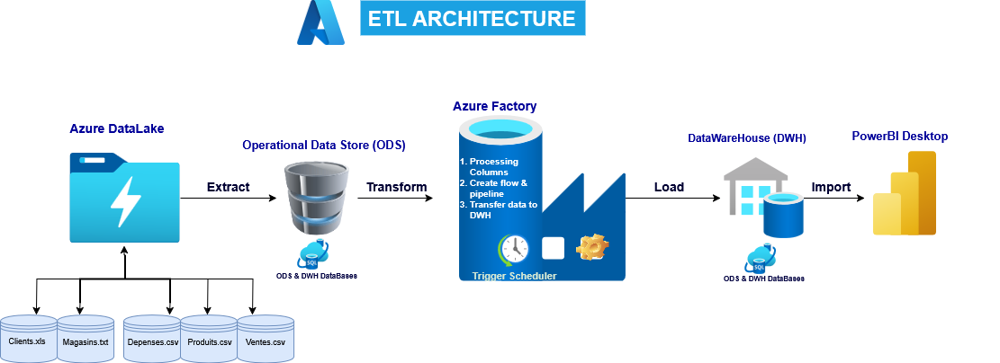
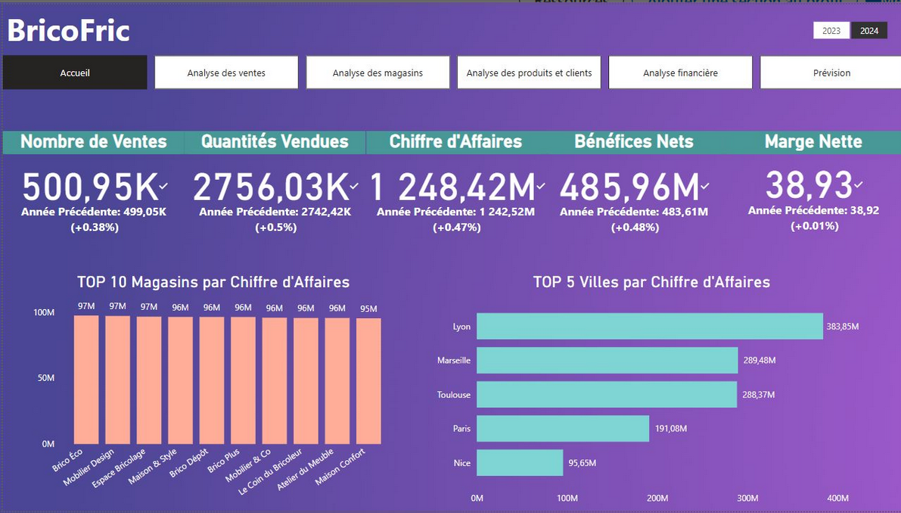

# Project Objective
- Build a Dashboard With PowerBI Desktop on Furnitures Sales Data  
- The project is divided into two parts
## Part 1: Build an ETL with Microsoft Azure Services to feed my DataWareHouse
- Azure SqlServer Service
- Azure SqlDatabase Service
- Azure DataFactory Service

## Part 2: Build the Dashboard connecting PowerBI Desktop to my Sql Server
- Connect and process Columns with PowerQuery
- Create DAX measures (KPI) for Sales
- Build the differents pages of my Dashboard 

