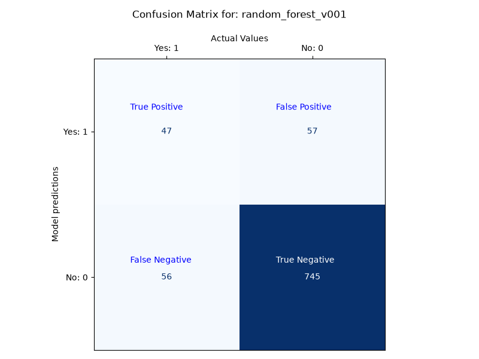
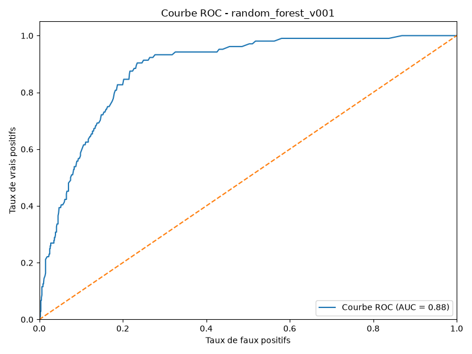
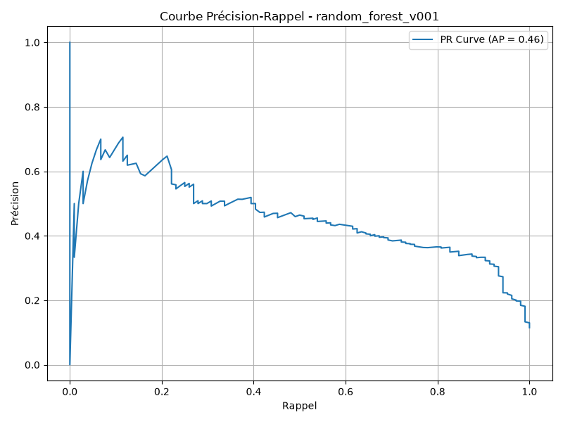
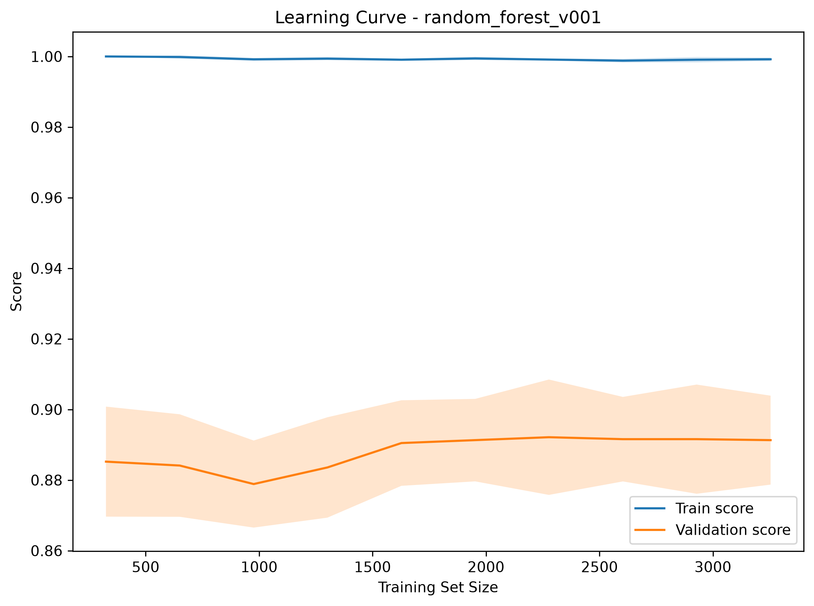

# Model Evaluation Report

## Model

- Model: random_forest_v001

## Classification Report

| Class | Precision | Recall | F1-Score | Support |
|---|---:|---:|---:|---:|
| False | 0.9289 | 0.9301 | 0.9295 | 801 |
| True | 0.4563 | 0.4519 | 0.4541 | 104 |

| Aggregate | Precision | Recall | F1-Score | Support |
|---|---:|---:|---:|---:|
| macro avg | 0.6926 | 0.6910 | 0.6918 | 905 |
| weighted avg | 0.8746 | 0.8751 | 0.8749 | 905 |

## Accuracy

- Accuracy: 0.8751

## Confusion Matrix

## ROC Curve

## Precision-Recall Curve

## Learning Curve

