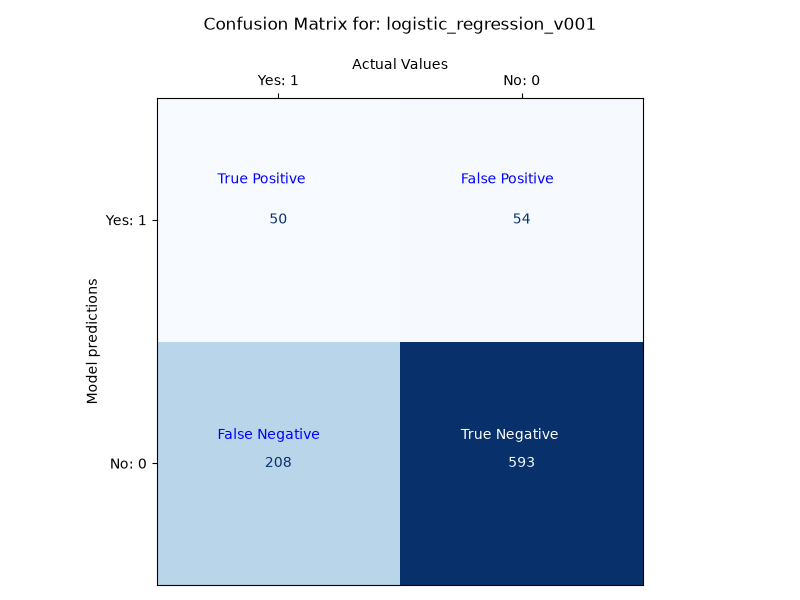
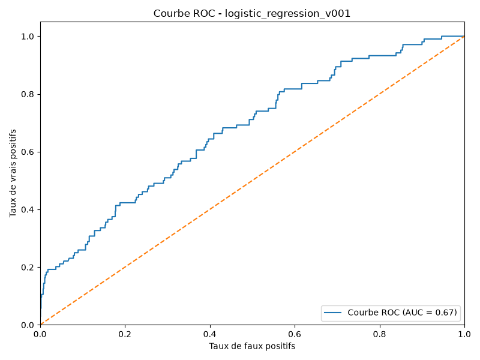
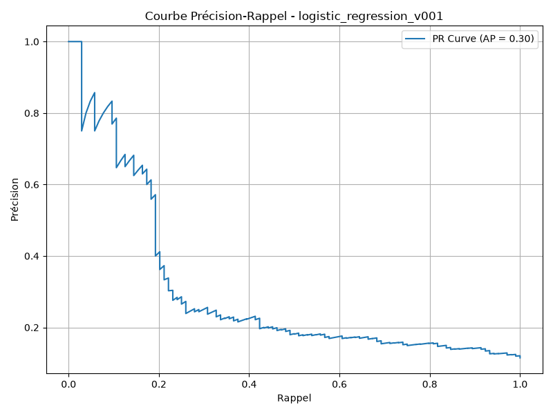
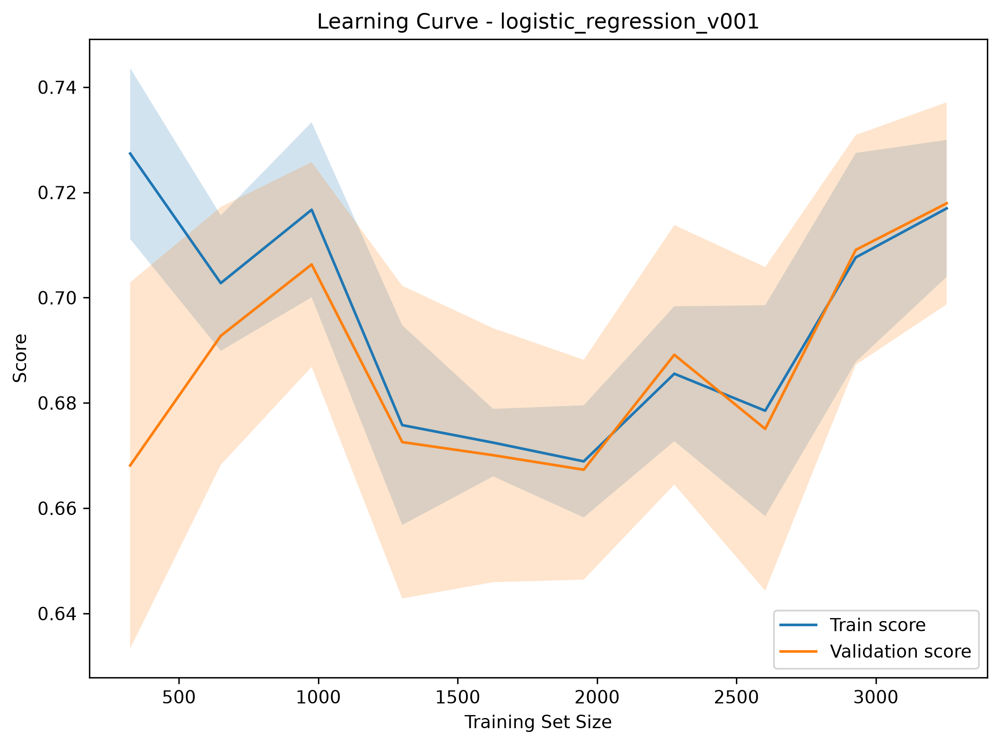
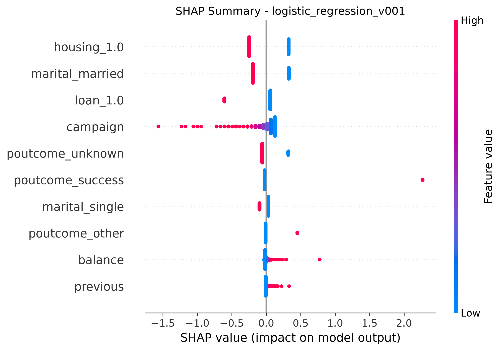
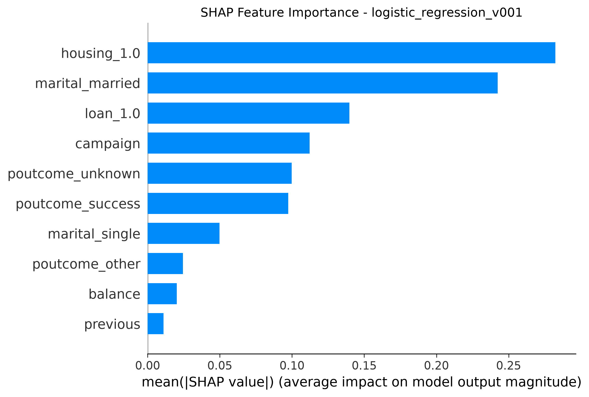
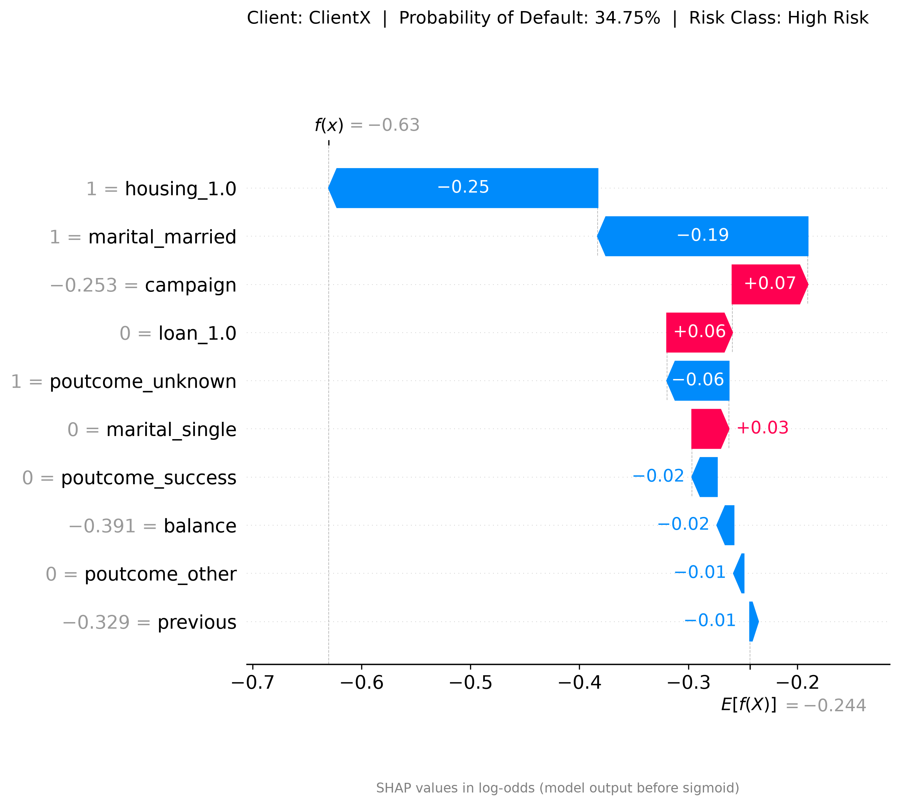

# Model Evaluation Report

## Model

- Model: logistic_regression_v001

## Classification Report

| Class | Precision | Recall | F1-Score | Support |
|---|---:|---:|---:|---:|
| False | 0.9165 | 0.7403 | 0.8191 | 801 |
| True | 0.1938 | 0.4808 | 0.2762 | 104 |

| Aggregate | Precision | Recall | F1-Score | Support |
|---|---:|---:|---:|---:|
| macro avg | 0.5552 | 0.6105 | 0.5477 | 905 |
| weighted avg | 0.8335 | 0.7105 | 0.7567 | 905 |

## Accuracy

- Accuracy: 0.7105

## Confusion Matrix

## ROC Curve

## Precision-Recall Curve

## Learning Curve

## Model Interpretability (SHAP)

### SHAP Summary

### SHAP Feature Importance

### SHAP Waterfall - ClientX

