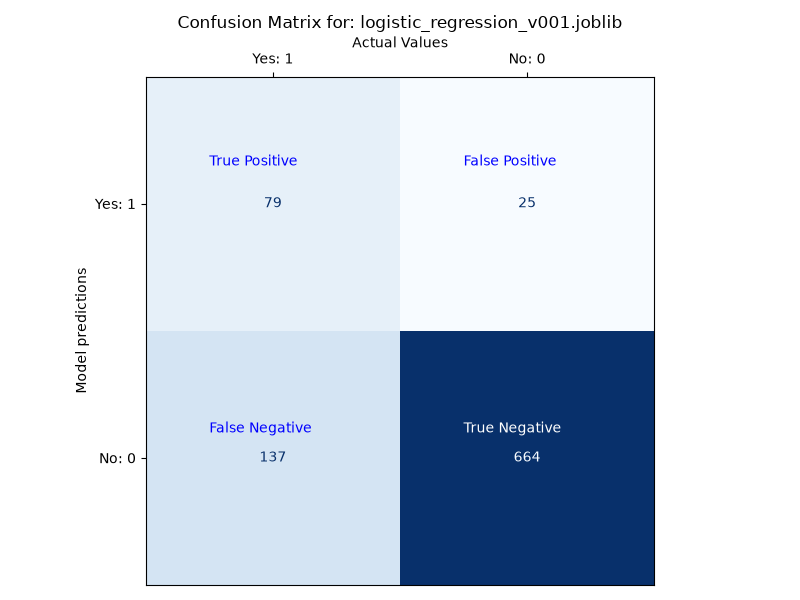
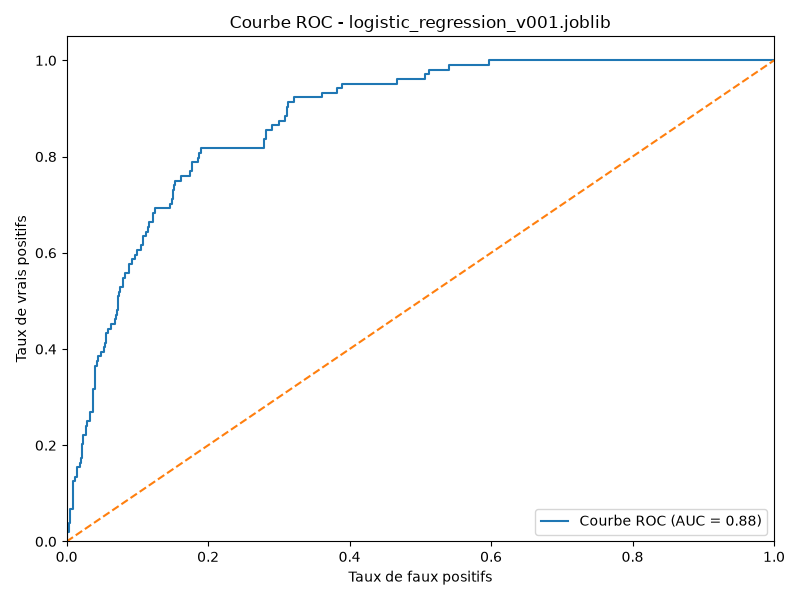
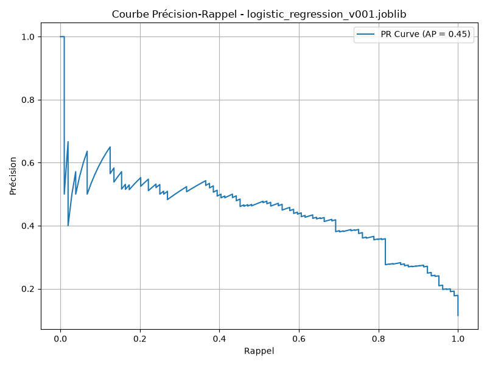
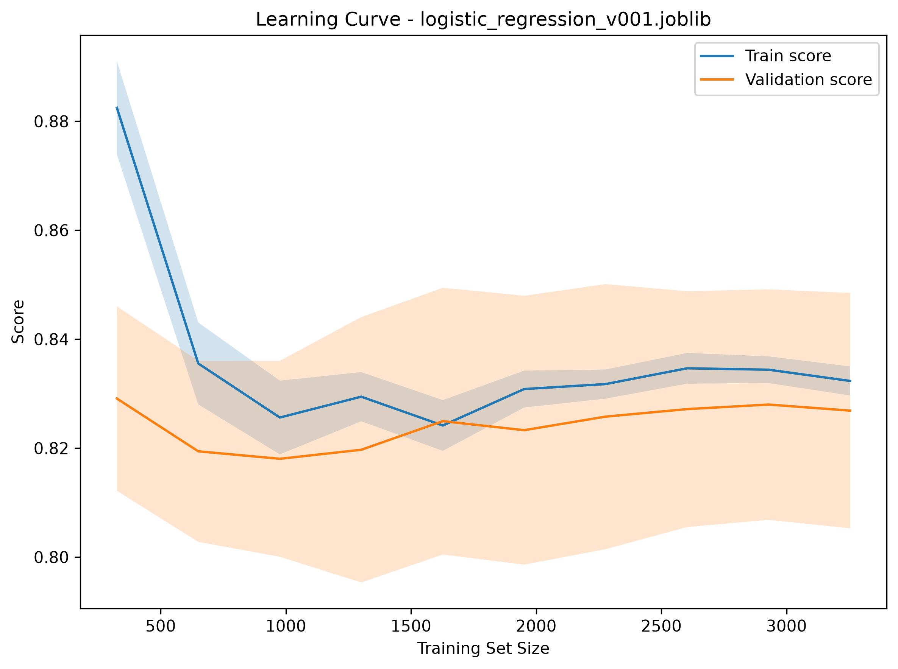

# Model Evaluation Report

## Model

- Model: logistic_regression_v001.joblib

## Classification Report

| Class | Precision | Recall | F1-Score | Support |
|---|---:|---:|---:|---:|
| False | 0.9637 | 0.8290 | 0.8913 | 801 |
| True | 0.3657 | 0.7596 | 0.4938 | 104 |

| Aggregate | Precision | Recall | F1-Score | Support |
|---|---:|---:|---:|---:|
| macro avg | 0.6647 | 0.7943 | 0.6925 | 905 |
| weighted avg | 0.8950 | 0.8210 | 0.8456 | 905 |

## Accuracy

- Accuracy: 0.8210

## Confusion Matrix

## ROC Curve

## Precision-Recall Curve

## Learning Curve

